  <h3><code>skaiiner@github ~ $ ./contributions.sh</code></h3>
  
    
  <h3><code>skaiiner@github ~ $ whoami</code></h3>
  <table>
    <tr>
      <td valign="top"></td>
      <td valign="top"></td>
    </tr>
  </table>
   
  <h3><code>skaiiner@github ~ $ ls projects/</code></h3>

| Project | What it is |
| --- | --- |
| [**GeoPilot**](https://github.com/Skaiiner/gps) | Desktop app to simulate an iPhone's GPS location over USB, with teleport, street routes and joystick. |
| [**Vocal AI Studio**](https://github.com/Skaiiner/Vocal-IA-Studio) | Local-first desktop vocal studio: pitch analysis, voice lab, AI coach, stem separation. By default your audio never leaves your PC. |
| [**VisageCam**](https://github.com/Skaiiner/VisageCam) | Virtual camera for Windows with face tracking, masks, accessories and effects, written in Python. |
